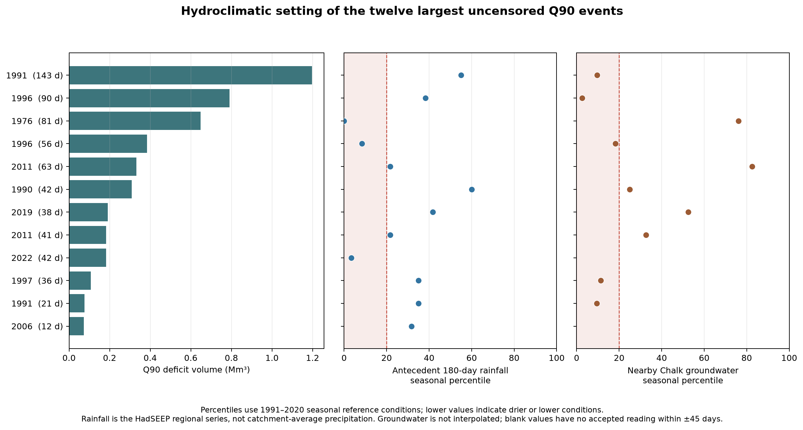
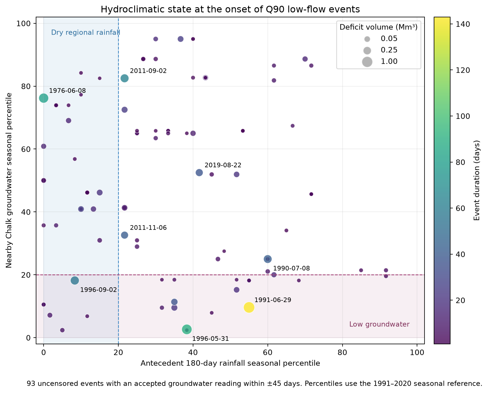

# Rainfall and groundwater setting of low-flow events

## Purpose

River-flow thresholds identify when a hydrological drought occurred at Fakenham, but they do not show the antecedent meteorological or groundwater state. This step places each uncensored Q90 event alongside two independent indicators: 180- and 365-day regional rainfall totals and the nearest accepted Chalk groundwater observation at event onset.

## Main results

Of 123 uncensored Q90 events, 39 (31.7%) began with the preceding 180-day HadSEEP total below its seasonally matched 20th percentile. A nearby accepted groundwater observation was available within ±45 days for 93 events (75.6%); 21 of those 93 observations (22.6%) were below their monthly 20th percentile.

The largest events do not share a single antecedent signature. The 1976 event followed an exceptionally dry regional half-year (0th percentile), whereas its nearby groundwater observation at onset was not low relative to other June observations. The 1991 and 1996 events began with very low groundwater percentiles even though their 180-day regional rainfall totals were not always in the driest fifth. The September 1996 event combined low regional rainfall and low groundwater. These differences are hydrologically plausible in a groundwater-influenced Chalk catchment: rainfall deficits, stored groundwater and river response can operate over different timescales.

The state-space view shows the same evidence without restricting the display to the largest events. Point area represents accumulated flow deficit and colour represents event duration. Events occupy all four rainfall–groundwater quadrants, although several of the largest deficits occur where groundwater is below its seasonal 20th percentile. This distribution argues against using a single antecedent indicator as an explanation for all low-flow events.

## Interpretation

The comparison supports a process-aware reading of the flow record, but it is not an attribution analysis. HadSEEP represents South East England rather than rainfall averaged over the Wensum catchment. The groundwater record is irregular and comes from one nearby borehole; values are not interpolated across gaps. Percentiles describe conditions close to event onset, not their evolution through the event. Abstraction and other artificial influences identified in the Fakenham metadata remain unresolved.

The next spatial refinement would be catchment-average HadUK-Grid rainfall, subject to obtaining access through the free CEDA registration process and documenting the selected grid cells and extraction method.

## Derived records

- `outputs/q90_event_hydroclimate_context.csv` contains event dates, flow-deficit statistics, antecedent rainfall totals and percentiles, and groundwater observations with their date offsets.
- `outputs/hydroclimate_context_summary.json` records coverage counts, headline proportions, the largest-event context and interpretation limits.
- `data/provenance/hydroclimate_context.json` records publishers, licences, station and measure identity, request URLs and file checksums.
