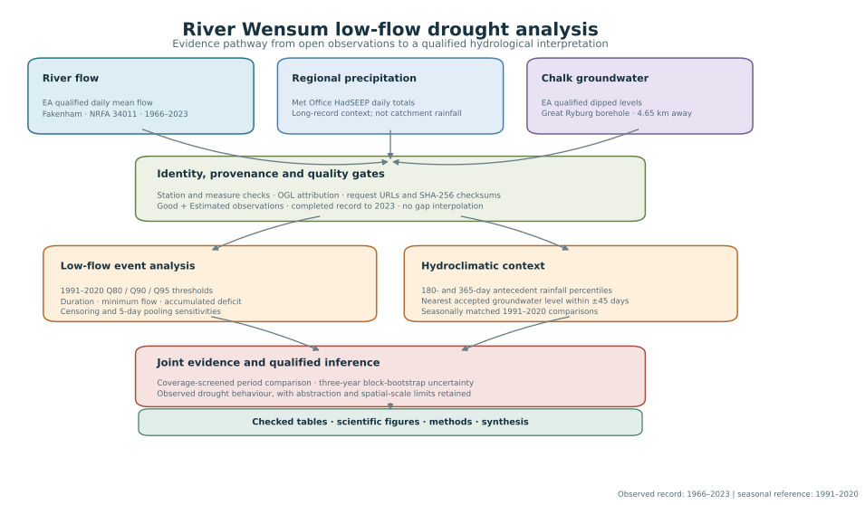

# Methods

## Flow screening

The primary series contains Environment Agency qualified daily mean flow, \(Q_t\), in m³/s. A day enters the main calculation when it has a numeric value, is marked `Complete`, and has a quality flag of either `Good` or `Estimated`. A stricter sensitivity calculation retains `Good` values only. `Suspect`, `Unchecked`, `Missing` and incomplete records are excluded.

The initial analysis ends on 31 December 2023 because much of the 2024–2026 record remains unchecked. No missing or rejected value is interpolated.

## Low-flow thresholds

Q80, Q90 and Q95 are empirical flow-duration statistics calculated from 1991–2020. Q90, for example, is the flow equalled or exceeded on 90% of accepted reference-period days; equivalently it is the 10th non-exceedance percentile. Linear interpolation between ordered observations is used.

Q90 is the main event threshold. Q80 and Q95 show how event detection changes under less and more extreme definitions. Thresholds are recalculated under the good-only screen rather than reusing the main value.

## Event statistics

An event is initially a run of consecutive accepted days for which \(Q_t < Q_{90}\). Its accumulated deficit volume is

\[
V_e = 86{,}400 \sum_{t=1}^{n_e} \max(0, Q_{90} - Q_t),
\]

where \(V_e\) is in m³ and \(n_e\) is the event duration in days. Minimum flow, duration, start and end dates are also retained.

An event touching an excluded or absent day is marked as censored because its true boundary or deficit may be unknown. Censored events are retained in the output table but excluded from summary maxima and totals. A sensitivity case merges events separated by no more than five accepted above-threshold days; gaps containing rejected or missing observations are never bridged.

## Period comparison

The 57 complete calendar years from 1967 to 2023 are divided into three equal descriptive periods: 1967–1985, 1986–2004 and 2005–2023. These are equal record segments, not official climatological normals. A year contributes to period statistics only when at least 95% of its daily observations pass the relevant quality screen.

Mean annual days below Q90 and mean annual deficit are reported for each period. Uncertainty intervals are the 2.5th and 97.5th percentiles of 10,000 overlapping three-year block-bootstrap replicates. Blocks retain short multi-year persistence and the positions of excluded years. The intervals describe sampling variability in this gauge record; they do not include uncertainty from rating changes, abstraction, threshold choice or climate attribution.

## Hydroclimatic context

Antecedent precipitation is represented by the Met Office HadUKP South East England daily series (HadSEEP). Totals are calculated over the 180 and 365 complete days ending immediately before each Q90 event begins. To remove the first-order seasonal cycle, each total is ranked against 30 totals ending on the same calendar date in 1991–2020. A percentile below 20 therefore means that the regional antecedent total was among the driest fifth of seasonally comparable reference values. HadSEEP is a broad regional areal series and is used as context, not as a substitute for catchment-average rainfall over the Wensum.

Groundwater context uses qualified dipped levels from the Environment Agency Chalk borehole labelled `Great Ryburg`, approximately 4.65 km from the Fakenham gauge. `Good` and `Estimated` observations are accepted. The closest observation to each event start is used only when it lies within ±45 days; no interpolation is applied. Its percentile is calculated from accepted observations in the same calendar month during 1991–2020. The monthly comparison limits seasonal bias, but the irregular measurements, one-borehole representation and possible local influences remain material limitations.

These percentiles describe conditions at event onset. They do not measure conditions over an event's full duration and do not establish whether climate, abstraction or another process caused the low flow.
