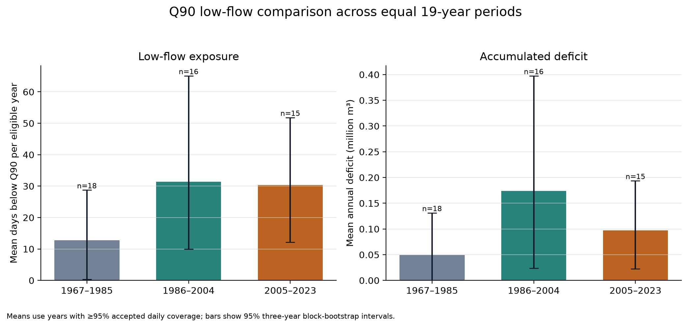

# Period comparison

## Coverage-screened result

Three equal 19-year periods were compared using the fixed 1991–2020 Q90 threshold of 0.274 m³/s. Years with less than 95% accepted daily coverage were excluded. This retained 18 years in 1967–1985, 16 in 1986–2004 and 15 in 2005–2023.

Mean annual low-flow exposure increased from 12.8 days in 1967–1985 to 31.4 days in 1986–2004 and 30.4 days in 2005–2023. Mean annual accumulated deficit was 0.050, 0.174 and 0.097 million m³ respectively. The middle period therefore contains the largest average deficit, influenced by substantial low-flow conditions in 1992 and 1996, while the latest period contains low-flow days in a larger fraction of its eligible years: 10 of 15, compared with 5 of 18 in the earliest period. Some 1992 event boundaries are censored by rejected observations, so its annual total is descriptive rather than a complete event-volume estimate.

## Uncertainty and sensitivity

The accepted-value late-minus-early contrast is +15.7 low-flow days per year, with a 95% three-year block-bootstrap interval from −7.4 to +40.8 days. The corresponding mean annual deficit contrast is +0.043 million m³, with an interval from −0.068 to +0.156 million m³. Both intervals include zero, so these data do not establish a clear difference between the earliest and latest periods.

The good-only calculation leads to the same interpretation. Its late-minus-early contrasts are +14.2 days and +0.043 million m³, and both uncertainty intervals also cross zero. Including complete estimated observations therefore does not control the direction of the comparison.

## Interpretation

The observed series suggests that low-flow exposure was more frequent after the mid-1980s than in the earliest segment, but severity is episodic rather than progressively increasing: the middle period has the largest mean deficit. This is descriptive evidence from one gauge. It is not sufficient to infer a climatic trend because the record is affected by missing years, threshold choice and an unquantified groundwater-abstraction influence. A defensible climatic interpretation would require rainfall and groundwater context, information on artificial influences, and preferably naturalised flows or a benchmark comparison.
