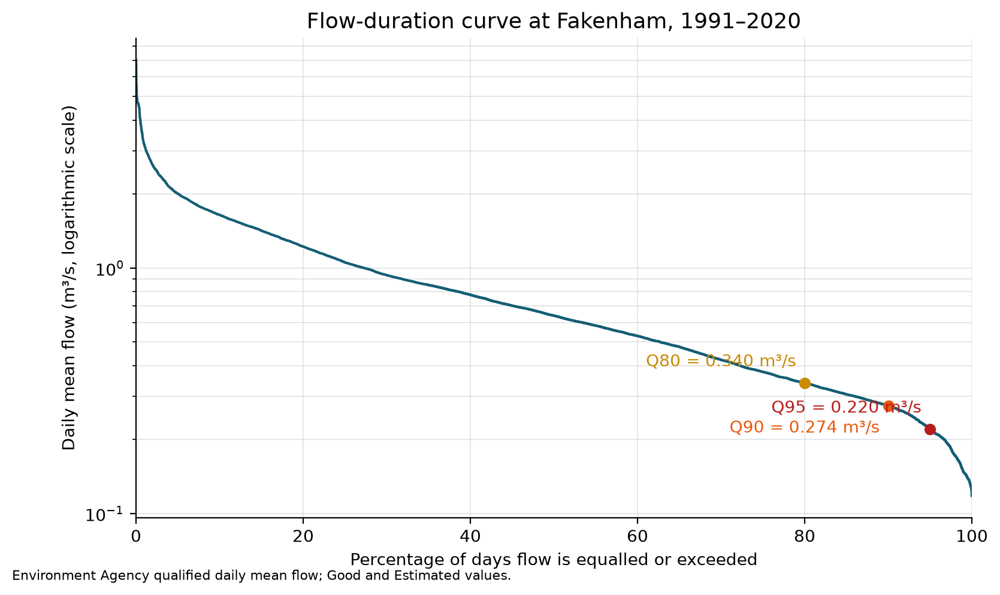
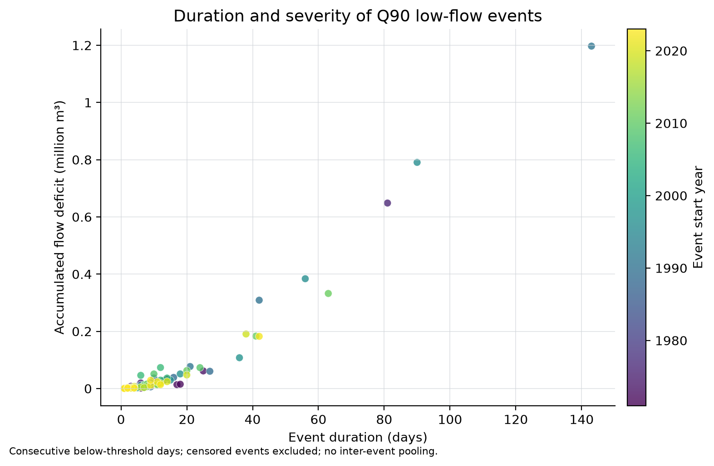
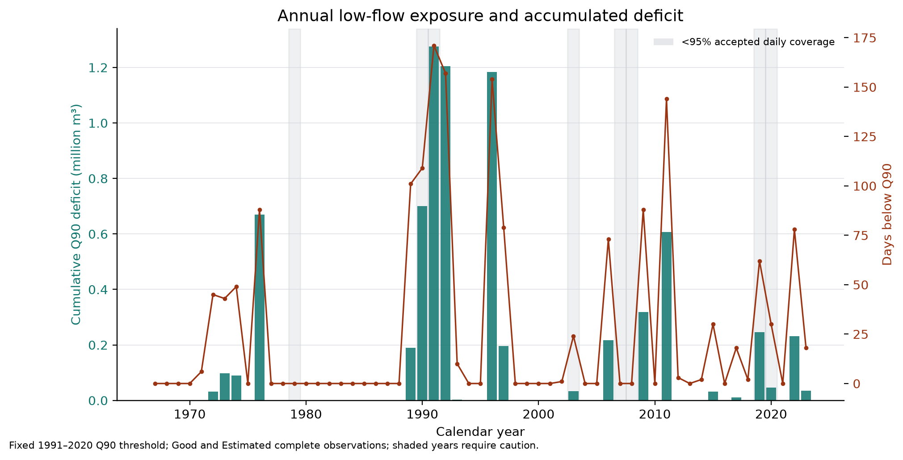
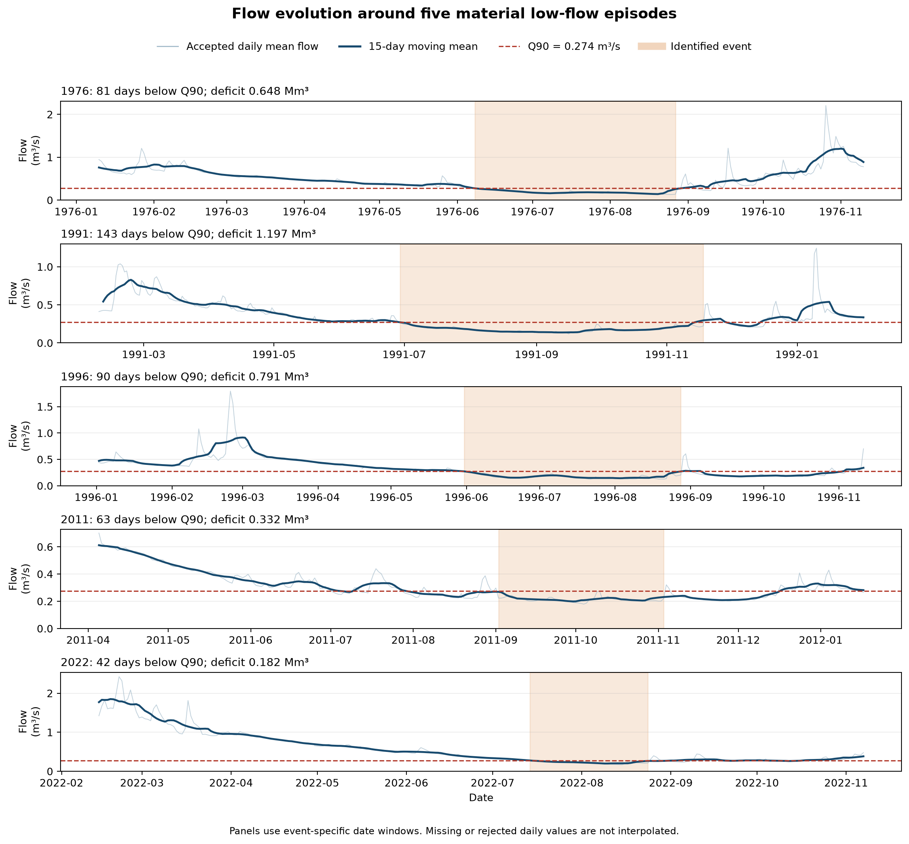

# Preliminary low-flow results

## Thresholds

Using complete observations flagged `Good` or `Estimated` during 1991–2020 gives Q80, Q90 and Q95 flows of 0.340, 0.274 and 0.220 m³/s respectively. Recalculating from `Good` values alone gives 0.337, 0.273 and 0.218 m³/s. The small changes indicate that estimated observations have little influence on the three threshold values, although they may still affect individual event boundaries.

## Event characteristics

With Q90 fixed at 0.274 m³/s, 123 uncensored runs of consecutive below-threshold days were identified between May 1966 and December 2023. The longest uncensored run began on 29 June 1991 and lasted 143 days, with an accumulated deficit of 1.197 million m³ and a minimum daily mean flow of 0.118 m³/s. The next largest deficits occurred during events beginning in 1996 and 1976. Material later events include sequences beginning in 2011 and 2022.

The 1991 event is not directly bounded by a rejected or missing observation, but only 89.6% of that calendar year's daily values pass the accepted quality screen. It should therefore be retained with an annual-coverage warning rather than described unconditionally as the record's most severe drought.

## Sensitivity

Threshold selection changes the number of identified events substantially: Q80 yields 165 uncensored events, Q90 yields 123 and Q95 yields 35 when no interruptions are pooled. Merging events separated by no more than five valid days reduces the Q90 series from 142 to 75 events before censoring and increases the longest event span from 143 to 160 days. This confirms that threshold and pooling rules must be reported with every event statistic.

The Q90 good-only case gives 121 uncensored events, compared with 123 when complete estimated values are also accepted. Its largest event retains the same 143-day duration and its estimated deficit changes from 1.197 to 1.185 million m³. The principal event pattern is therefore not being created by the decision to include estimated observations.

## Flow evolution during material episodes

The five selected hydrographs show that the identified events are embedded in longer recession and recovery sequences. In 1976 and 2022, flow declined over several months before crossing Q90. The 1991 and 1996 events remained substantially below the threshold for much of the summer, producing the largest accumulated deficits. The 2011 episode began later in the year and persisted into November. The smoothed lines are descriptive only; event statistics retain the accepted unsmoothed daily values.

## What these results do not show

The chart describes gauged low-flow behaviour, not operational drought status for an Anglian Water resource zone. It also does not demonstrate a climate trend. The Fakenham metadata identifies an unquantified groundwater-abstraction influence, and several years have incomplete or rejected observations. Period comparisons and uncertainty intervals are required before making a defensible statement about temporal change.

The completed coverage-screened comparison is reported in [period-comparison.md](period-comparison.md). Its late-minus-early uncertainty intervals include zero, so the available record does not establish a clear change between those two periods.
